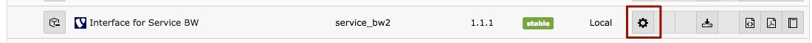

.. ==================================================
.. FOR YOUR INFORMATION
.. --------------------------------------------------
.. -*- coding: utf-8 -*- with BOM.

.. include:: ../Includes.txt

.. _admin-manual:

Administrator Manual
====================

.. _admin-installation:

Installation
------------

You can install the extension either using the TYPO3 extension manager or using composer.

TYPO3 extension manager
~~~~~~~~~~~~~~~~~~~~~~~

1. Login to the TYPO3 backend
2. Navigate to ADMIN TOOLS > Extensions
3. Click on "Get Extensions" at the top of the frame
4. Update your extension list if it´s older than 24 hours
5. Search for service_bw2 and click on the install button

Composer
~~~~~~~~

1. Add service_bw2 to your composer.json e.g. using :php:`composer install jweiland/service-bw2`

2. Activate the extension inside the TYPO3 extension manager

.. _admin-configuration:

Configuration
-------------

You need to edit the extension configuration after the installation. Open the extension manager, search for
service_bw2 and click on the settings-icon.

You have to fill in at least the following settings:

Username
   The username provided by Service BW for API usage. (Mostly starts with ws_)

Password
   The password provided by Service BW for API usage.

Mandant
   The mandant number of the city.

BaseUrl
   The URL where we can access the API of Service BW. Defaults to: `https://sgw.service-bw.de:443/`

Allowed languages
   This is important if your website is multi language. Format: [2 letters language ISO code]=[sys_language_uid].
   Assign multiple languages with ";". Example: de=2;en=5. First value will be used as default language.

Region IDs
   Type in each Region ID of the areas of your city. If you don't know them, please fill AGS or PLZ below.

AGS
   This is the Official Municipality Key of your city. We need it to find all Region IDs.

ZIP
   If you don't know the Region IDs not the AGS of your city, you have to insert ONE of your ZIP codes here.

If not already done then you need to configure maps2, because service_bw2 has a maps2 integration for departments.
Take a look into the maps2 documentation for that.

Upgrade
-------

Version 3.0.0
~~~~~~~~~~~~~

We have simplified the Plugin Configuration. That's why you have to change your TS Setup and TS Constants from

plugin.tx_servicebw2_servicebw

to

plugin.tx_servicebw2

Version 2.1.1
~~~~~~~~~~~~~

Bugfix Release for TYPO3 9.
As there is no StringFrontend in Caching System of TYPO3 9 anymore we had to switch over to VariableFrontend. Now the
cache data itself will be stored in another format, that's why you have to Clear all Caches.
