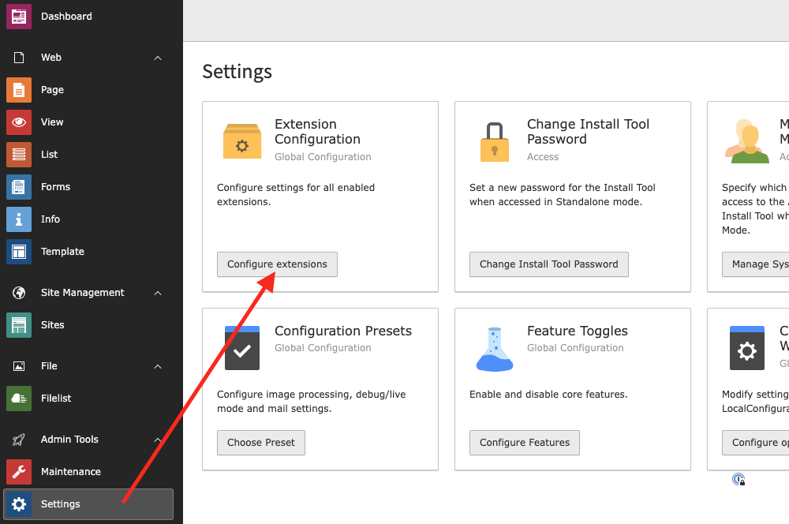
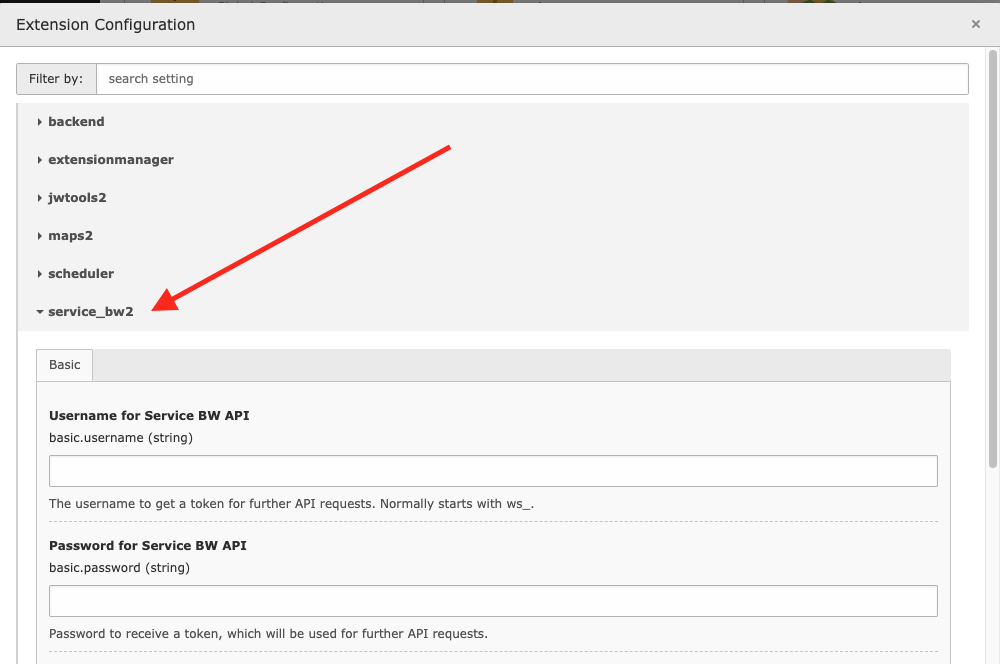

..  include:: /Includes.rst.txt

..  _extensionSettings:

==================
Extension Settings
==================

After the installation you need to configure the extension settings. Login
to TYPO3 backend as an administrator or system maintainer and chose
`Settings` from the left main menu. Click `Configure Extensions` from the
first panel and chose `service_bw2` from the extension list.

Tab: Basic
==========

Username for Service BW API
---------------------------

Default: <empty>

The username provided by Service BW for API usage. (Mostly starts with `ws_`)

Password for Service BW API
---------------------------

Default: <empty>

The password provided by Service BW for API usage.

Mandant
-------

Default: <empty>

The mandant number of the city.

Base URL
--------

Default: `https://sgw.service-bw.de:443/`

The URL where we can access the API of Service BW. In most cases there is no
need to change that value.

It's just `[scheme:domain:port]`. Do not enter a path to a specific API version,
as `service_bw2` does that for you automatically in `ServiceBwClient`
class. `service_bw2` will use the API V2 endpoint internally.

Allowed languages
-----------------

Default: `de=0;en=0;fr=0`

This is important if your website is multi language.

Format: [2 letters language ISO code]=[sys_language_uid].

Assign multiple languages with ";".

Example: de=2;en=5.

First value will be used as default language.

AGS
---

Default: <empty>

German description of Service BW API:

..  code-block::

    Die amtlichen Gemeindeschlüssel, in deren Kontext man diese Operation
    ausführen möchte.

Optional parameter for API requests. Leave empty to not use this filter option.

Gebiet ID
---------

Default: <empty>

German description of Service BW API:

..  code-block::

    Die IDs der Gebiete, in deren Kontext man diese Operation ausführen möchte.

Optional parameter for API requests. Leave empty to not use this filter option.
