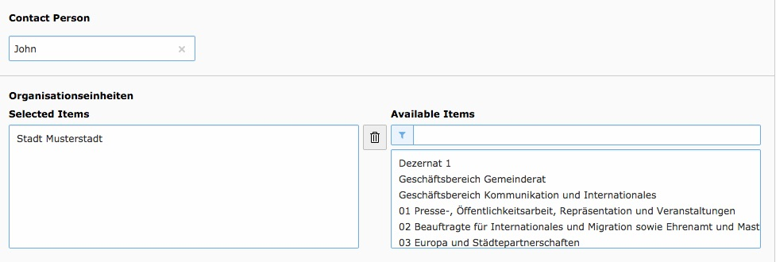

.. ==================================================
.. FOR YOUR INFORMATION
.. --------------------------------------------------
.. -*- coding: utf-8 -*- with BOM.

.. include:: ../Includes.txt

.. _developer:

Developer Corner
================

.. _developer-api:

Important notes
---------------

We are using the german method names of the Service BW API in our extension to make it easier to extend/understand the extension.

API
---

This extension provides APIs to use departments (Organisationseinheiten) in other extensions.

Use departments in TCA
~~~~~~~~~~~~~~~~~~~~~~

   Departments inside a non service_bw2 extension TCA

The TCAUtility makes the usage of departments in TCA very easy.
You just need to use the static method getOrganisationseinheitenFieldTCAConfig in your TCA like shown below.

.. code-block:: php

  'organisationseinheiten' => [
      'exclude' => true,
      'label' => 'LLL:EXT:foo/Resources/Private/Language/locallang_db.xlf:tx_foo_domain_model_bar.organisationseinheiten',
      'config' => \JWeiland\ServiceBw2\Utility\TCAUtility::getOrganisationseinheitenFieldTCAConfig()
  ],

You can customize the default department TCA configuration even if you´re using the utility.
For example if you only want one item maximum:

.. code-block:: php

  'organisationseinheit' => [
      'exclude' => true,
      'label' => 'LLL:EXT:foo/Resources/Private/Language/locallang_db.xlf:tx_foo_domain_model_bar.organisationseinheit',
      'config' => \JWeiland\ServiceBw2\Utility\TCAUtility::getOrganisationseinheitenFieldTCAConfig(['maxitems' => 1])
  ],

Get department item(s) by id
~~~~~~~~~~~~~~~~~~~~~~~~~~

The ModelUtility provides two public static methods to request either a single or multiple departments.

Get a single department
***********************

Use the method getOrganisationseinheit for that. The first parameter must be either the (int|string) id of the
department to request or an array (this is very useful if you´re using the method inside a getter method).

**Model example:**

.. code-block:: php

  /**
   * Department (API name: Organisationseinheit)
   * Initially a string but will be converted to an array when
   * calling getter the first time!
   *
   * @var string
   */
  protected $organisationseinheit = '';

  /**
   * Returns Organisationseinheit
   *
   * @return array
   */
  public function getOrganisationseinheit(): array
  {
      return $this->organisationseinheit = ModelUtility::getOrganisationseinheit($this->organisationseinheit);
  }

Get multiple departments
************************

Use the method getOrganisationseinheiten for that. The first parameter must be either a single id (int|string),
multiple ids separated by comma (e.g. 12,45) or an array (this is very useful if you´re using the method inside a getter method).

**Model example**

.. code-block:: php

  /**
   * Departments (API name: Organisationseinheiten)
   * Initially a string but will be converted to an array with records when
   * calling getter the first time!
   *
   * @var string
   */
  protected $organisationseinheiten = '';

  /**
   * Returns Organisationseinheiten
   *
   * @return array
   */
  public function getOrganisationseinheiten(): array
  {
      return $this->organisationseinheiten = ModelUtility::getOrganisationseinheiten($this->organisationseinheiten);
  }

.. tip::

   If you pass an array then both methods will return this array back without any modification. That
   makes it possible to call the methods in the getter without adding logic around it.

