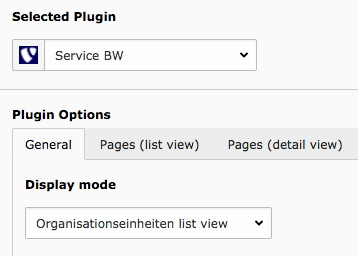
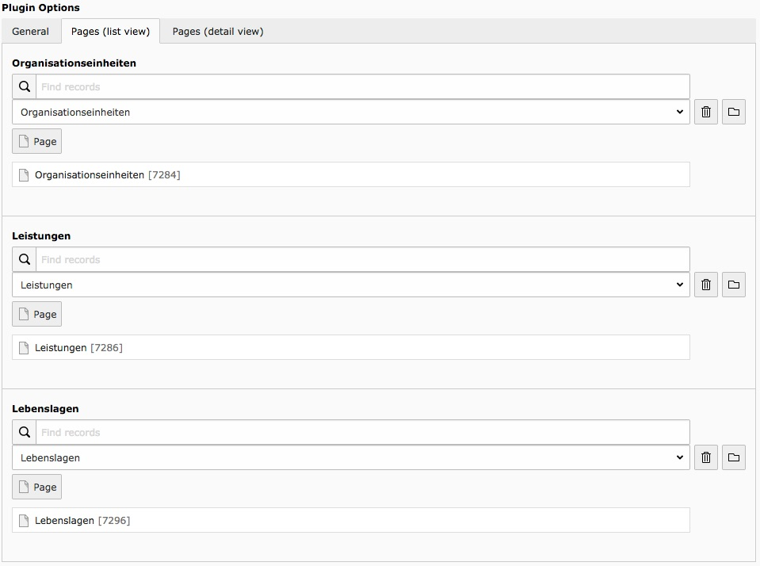
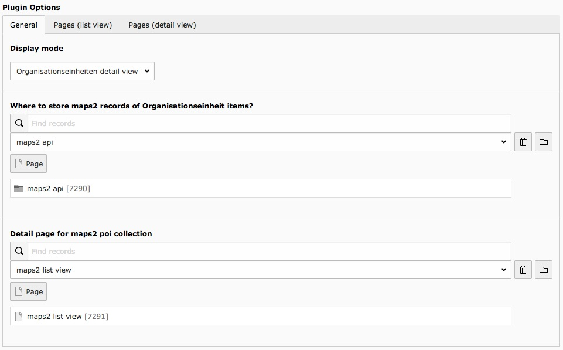
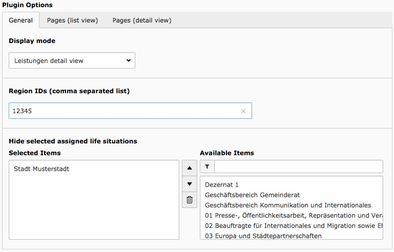

.. ==================================================
.. FOR YOUR INFORMATION
.. --------------------------------------------------
.. -*- coding: utf-8 -*- with BOM.

.. include:: ../Includes.txt

.. _user-manual:

Users Manual
============

The extension adds a plugin called "Service BW". This plugin is well configurable thanks to flex forms.

There are three types of items right now. The important thing is that some of them are connected to other types.
For example a department (Organisationseinheit) can have some Services (Leistungen).
Because of that behaviour you have to set the detail and list pages in every Service BW plugin.

   Example configuration

Type specific configuration
---------------------------

There may be some additional configuration for a type. In this section you can take a look at those settings.

Departments (Organisationseinheiten)
~~~~~~~~~~~~~~~~~~~~~~~~~~~~~~~~~~~~

List view
*********

Choose items to display (recursive)
  Most time it´s not necessary to display all departments with all children in one list.
  You can define one or more start points with this setting. For example: Your city is a department and all city related
  departments are children of the city department. In this case you select the city department as starting point to
  get a cleaner list.

Detail view
***********

This extension has a ext:maps2 integration for departments. The address provided by the Service BW API will be used to
create maps2 records for a department.

Where to store maps2 records of Organisationseinheit items?
  The folder where maps2 records for service_bw2 have to stay.

Detail page for maps2 poi collection
  The detail page to display maps2 records coming from a department detail view.

   Example configuration

Services (Leistungen)
~~~~~~~~~~~~~~~~~~~~~

Detail view
***********

Region IDs (comma separated list)
  The region id will be used to display forms (API name: Externe Formulare) by region and service (Leistung)

Hide selected assigned life situations
  In this case assigned life situations are departments (Organisationseinheiten). Maybe you don´t want that
  your cities "main" department will be listed on every page. Then you can add those department(s) to the list.

